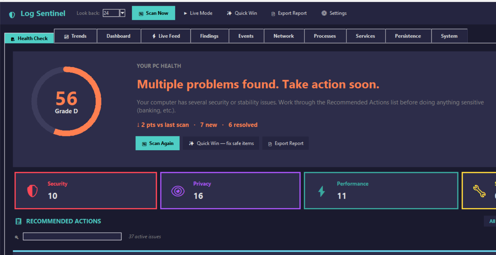
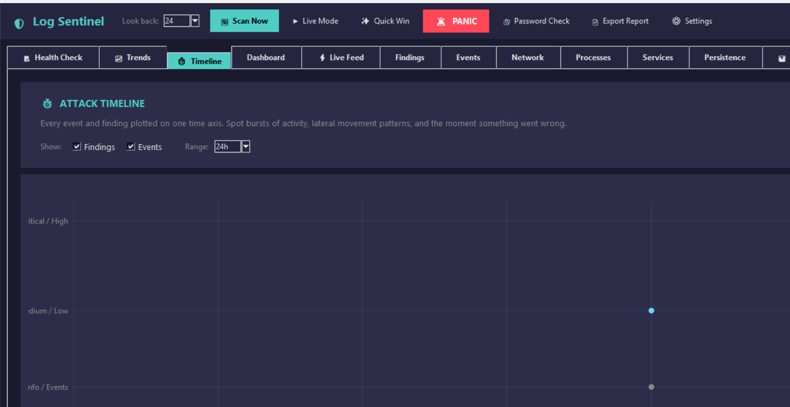
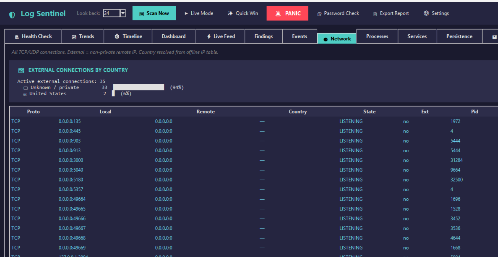
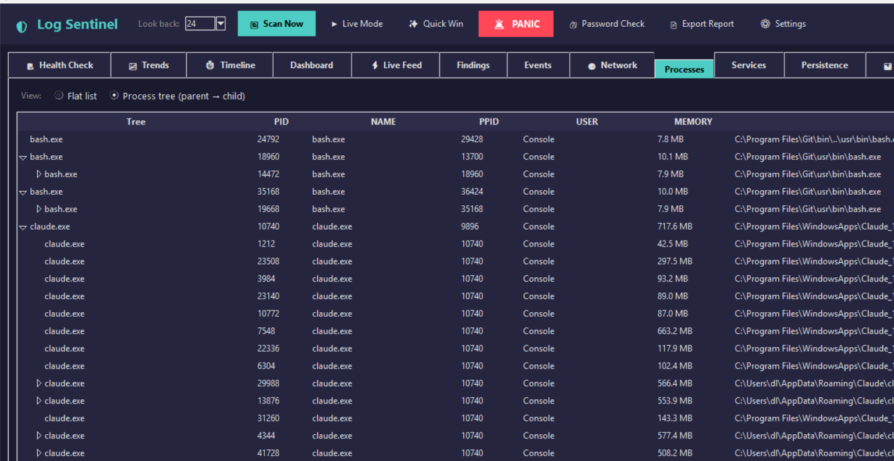

# Log Sentinel

Windows endpoint and log-analysis workstation for local security review, SOC practice, incident triage, and system health checks.

Log Sentinel collects Windows logs and host telemetry, runs detection rules, explains findings in plain English, maps security detections to MITRE ATT&CK where relevant, and exports readable reports for review or handoff.



## Project Purpose

This project is built as a practical blue-team portfolio tool. It demonstrates how a junior SOC analyst or security support technician can turn raw Windows data into actionable findings without manually jumping between Event Viewer, Task Manager, netstat, services, scheduled tasks, firewall rules, and system information screens.

It is not an antivirus replacement. It is a local investigation and reporting tool that helps answer:

- What happened on this Windows machine?
- Are there failed logins, suspicious services, risky ports, or persistence changes?
- Which findings matter first?
- What action should a non-technical user take next?
- Can this system be documented for a customer, buyer, or support case?

## Screenshots

### Health Check


### Windows Logs And Timeline



### Network And GeoIP



### Process Tree



### Generated Report

The app can export HTML, JSON, and PDF reports.

- [Sample HTML report](reports/demo_report.html)
- [Sample PDF report](reports/demo_report.pdf)

## Main Features

- Windows Event Log collection from Security, System, and Application channels
- Dedicated Logs tab with filters for failed passwords, successful logins, account changes, privilege events, system start/stop, and audit tampering
- Health score with severity-based recommended actions
- Findings grouped by Security, Privacy, Performance, and Stability
- MITRE ATT&CK mapping for supported detections
- Process inventory and parent-child process tree
- Network connection inventory with external IP and offline GeoIP context
- Services, scheduled tasks, autoruns, DNS cache, USB history, installed software, and recent files
- Baseline comparison for new services, autoruns, tasks, and listening ports
- File scanner for suspicious lab artifacts and EICAR-style test markers
- Windows Defender, Task Manager, Settings, firewall, and hosts-file remediation helpers
- Panic button for local network isolation
- System Info view for buyer checks: CPU, RAM, disk space, partitions, GPU, battery, BIOS, model, and serial
- Report export to HTML, JSON, and PDF
- Searchable help center
- 30-day local trial and monthly device-bound licence keys

## Detection Coverage

| Area | Examples |
|---|---|
| Authentication | Failed logins, brute-force patterns, account lockouts, off-hours logons |
| Privilege activity | Admin logons, privilege escalation events, account/group changes |
| Persistence | New services, scheduled tasks, autoruns, startup impact |
| Process behavior | Suspicious names, risky locations, known tool indicators, process impersonation |
| Network | Suspicious listening ports, uncommon ports, external connections, GeoIP context |
| PowerShell | Encoded commands and suspicious script block activity |
| Defense evasion | Audit log clearing, firewall changes, baseline drift |
| Ransomware practice | Honeypot tripwires and file integrity checks |
| Privacy | Camera/microphone access checks and browser extension review |
| System health | RAM pressure, startup bloat, crash/shutdown events, hardware summary |

## Quick Start

### Requirements

- Windows 10 or Windows 11
- Python 3.10 or newer
- PowerShell or Command Prompt

Most features work without administrator rights. To read the Security event log and use firewall/hosts isolation features, run as Administrator.

### Run From Source

```powershell
git clone https://github.com/dkshahzohaib/log-sentinel.git
cd log-sentinel
py -3 app.py
```

### Run As Administrator

Open PowerShell as Administrator:

```powershell
cd "C:\path\to\log-sentinel"
py -3 app.py
```

Administrator mode is needed for Security log events such as failed password attempts:

- `4625` - failed login / wrong password
- `4771` - Kerberos pre-authentication failed
- `4776` - credential validation failed

### Run A Headless Scan

```powershell
py -3 app.py --scan
```

### Build Portable EXE

```powershell
BUILD.bat
```

See [BUILD.md](BUILD.md) for build, signing, and release notes.

## How To Test Detections Safely

This repository includes harmless test artifacts in `fake_malware_lab/` and a local port listener test.

### Suspicious Port Test

```powershell
TEST-THREAT-PORT-4444.bat
```

Then run a scan. Log Sentinel should flag activity around port `4444`.

### File Scanner Test

Use the app's folder scan feature and select:

```text
fake_malware_lab
```

The included files are safe test samples, not real malware.

## Licensing Demo

The project includes a local 30-day trial and device-bound monthly key system for productization practice.

Generate a 30-day key:

```powershell
py -3 tools\make_license_key.py customer@example.com --days 30 --device MACHINE_ID
```

The Machine ID is shown in the activation window. This is suitable for controlled demos and portfolio work. A production commercial release should move key creation and activation checks to a private server.

## Repository Structure

```text
log-sentinel/
├── app.py                    # Tkinter desktop application
├── main.py                   # CLI/report entry point
├── demo.py                   # Synthetic demo data
├── BUILD.bat                 # Portable build script
├── src/
│   ├── collector.py          # Windows Event Log collection
│   ├── system_collector.py   # Processes, network, services, tasks, system info
│   ├── analyzer.py           # Event-based detections
│   ├── system_analyzer.py    # Host snapshot detections
│   ├── detection_pipeline.py # Shared GUI/headless detection flow
│   ├── baseline.py           # Baseline comparison
│   ├── reporter.py           # HTML, JSON, PDF, help output
│   ├── licensing.py          # Local trial and key handling
│   └── ...
├── tests/                    # Unit tests
├── reports/                  # Screenshots and sample reports
├── fake_malware_lab/         # Harmless test artifacts
├── outreach/                 # Product-page/support material drafts
└── tools/                    # Admin helper scripts
```

## Test Suite

```powershell
py -3 -m unittest discover -s tests -v
py -3 -m compileall -q app.py main.py demo.py src tests tools
```

Current coverage includes:

- Event analyzer rules
- System analyzer rules
- Health scoring
- Baseline detection
- File scanner
- Report generation
- Licence key handling
- Preference filtering
- Validation helpers

## Portfolio Notes

This project demonstrates:

- Windows log collection and parsing with `wevtutil`
- Security event interpretation for common SOC workflows
- Detection engineering using rule-based analytics
- Host telemetry collection and enrichment
- MITRE ATT&CK mapping
- GUI design for non-technical users
- Report generation for analyst handoff
- Test-driven hardening of detection and reporting logic
- Safe malware-lab style testing without real malware

## Security Notes

- Run as Administrator only when Security log, firewall, hosts file, or isolation features are required.
- Do not treat generated findings as final proof of compromise. Review evidence and context.
- The included suspicious files are harmless test samples.
- Local-only licence enforcement is not tamper-proof. Production licensing should use online activation and server-side signing.

## License

See [LICENSE](LICENSE).
